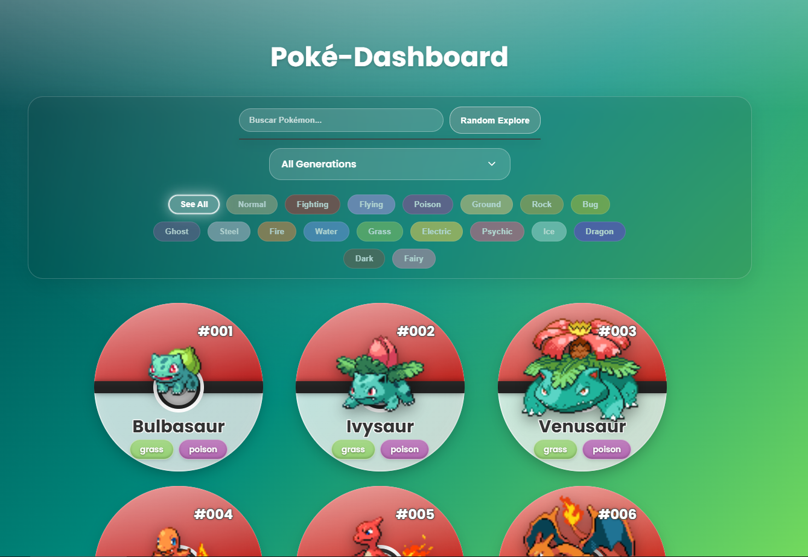

# Pokedex Project: A Decoupled Full-Stack Application

An interactive Pokedex application designed to explore Pokémon information, built with a modern, decoupled architecture. This project serves as a practical and functional platform for Quality Assurance (QA) and Quality Engineering (QE) professionals to implement features and apply testing strategies.

### 🚀 Live Demo

**[Visit the live application here!](https://amt-pokedex.netlify.app/)**

### ✨ Live Preview



---

### 🛠️ Tech Stack & Tools

<p align="center">
  
  
  
  
  
  
  
</p>

---

## 🏛️ Architecture

The application is built with a decoupled full-stack architecture, ensuring a clean separation of concerns between the frontend and backend.

*   **Backend:** Developed in **Python** using the **FastAPI** framework. It handles all business logic, interacts with the external [PokeAPI](https://pokeapi.co/), and exposes data through a RESTful API. Deployed on **Render**.
*   **Frontend:** A pure client-side application built with standard web technologies: **HTML** for structure, **CSS** for styling, and **JavaScript** for interactivity and consuming the backend API. Deployed on **Netlify**.

## ✅ Features

### Implemented

-   [x] **Pokémon Grid:** Displays Pokémon in a visually appealing and responsive grid.
-   [x] **Efficient Pagination:** Handles large amounts of data by loading Pokémon in batches via a Server-Sent Events (SSE) stream.
-   [x] **Live Search:** A search bar with autocomplete functionality suggests Pokémon names as the user types.
-   [x] **Dynamic Filtering:** Allows users to filter the grid by Pokémon type and generation.
-   [x] **"Surprise Me!":** A button to display a random selection of Pokémon.

### Future Roadmap

-   [ ] **Pokémon Detail Modal:** A pop-up view with detailed stats, abilities, and evolution chains when a Pokémon is clicked.
-   [ ] **Pokémon Comparator:** A tool to compare two Pokémon side-by-side.
-   [ ] **Team Builder:** Allows users to create and manage a team of up to 6 Pokémon.
-   [ ] **Team Analyzer:** Provides insights into a created team's strengths and weaknesses.

<p align="center">
  
  
  
  
  
  
</p>

## 🛠️ Local Development Setup

To run this project locally, you need to run the backend and frontend servers in two separate terminals.

**1. Run the Backend Server:**

Navigate to the project root directory and start the FastAPI server using Uvicorn.

```bash
# Installs dependencies
pip install -r requirements.txt

# Starts the API server on http://127.0.0.1:8000
uvicorn app.main:app --reload
```

**2. Run the Frontend Server:**

The recommended way is to use the **Live Server** extension in Visual Studio Code.

1.  Install the `Live Server` extension.
2.  Right-click the `public/index.html` file.
3.  Select "Open with Live Server".
4.  Your browser will open to `http://127.0.0.1:5500` (or a similar port).

Alternatively, you can use Python's built-in HTTP server. In a new terminal:

```bash
# Navigate into the public directory
cd public

# Start a simple web server on port 8081
python -m http.server 8081
```

## 🧪 QA/QE & CI/CD Focus

This project is designed to be a sandbox for testing and automation. Future goals include:

*   **CI/CD Pipeline:** Set up GitHub Actions to automate testing and deployments upon pull requests and merges.
*   **Automated Testing:**
    *   **Backend:** Implement unit and integration tests for the FastAPI endpoints using `pytest`.
    *   **Frontend:** Use a framework like Playwright or Cypress for end-to-end (E2E) tests that simulate user interactions.
*   **Containerization:** Package the application with Docker to ensure a consistent environment for development and testing.

## 🤖 Test Automation Framework Architecture

To support the project's QA/QE goals, a unified test automation framework will be developed. The architecture is designed to be robust, scalable, and maintainable, housing both API and End-to-End tests within a single, cohesive structure. This approach promotes code reuse, consistency, and consolidated reporting.

### Core Technologies

The framework will leverage the following industry-standard libraries:

*   **Test Runner:** **Pytest** will be used as the core test runner for both API and E2E tests, enabling powerful fixtures, assertions, and plugin-based extensions.
*   **API Testing:**
    *   **Requests:** For making clear and simple HTTP requests to the FastAPI backend.
    *   **Pydantic:** For rigorous data validation and contract testing, ensuring API responses match the expected schema.
*   **End-to-End (E2E) Testing:**
    *   **Playwright:** For reliable, modern browser automation that simulates real user interactions on the frontend.

### Proposed Folder Structure

The framework will follow a layered architecture to ensure a clean separation of concerns.

```
Pokedex-project/
├── tests/
│   ├── api/
│   │   ├── clients/
│   │   ├── data/
│   │   └── models/
│   ├── e2e/
│   │   └── pages/
│   └── conftest.py
│
├── core/
│   ├── helpers/
│   └── config.py
│
├── reports/
└── pytest.ini
```

*   **`core/`**: Contains shared framework logic, such as environment configuration (`config.py`) and reusable helper functions (`helpers/`).
*   **`tests/`**: The root for all test suites.
    *   **`tests/api/`**: Holds API-specific tests, API clients (request logic), and Pydantic data models (schema validation).
    *   **`tests/e2e/`**: Contains E2E tests and Page Object Models (`pages/`) for UI interaction.
*   **`reports/`**: A designated output directory for test reports and artifacts.

### 🚀 Development Progress & Next Steps

This section tracks the ongoing development of the test automation framework.

**✅ Completed Milestones:**

*   **Core Framework Setup:**
    *   Initialized the core structure, implemented a reusable `ApiClient`, established configuration management, and created a session-scoped `pytest` fixture.
*   **Initial Contract Tests & Advanced Models:**
    *   Successfully implemented API Contract Tests for `/api/generations`, establishing a baseline pattern for schema validation with `Pydantic`.
    *   Handled a complex Server-Sent Event (SSE) stream by implementing a **Pydantic Discriminated Union**, a robust pattern for modern, real-time APIs.
*   **Full Coverage for Stream Endpoint via Parametrization:**
    *   **Refactored with `parametrize`:** Replaced a single, monolithic test with a powerful, parameterized test (`test_pokemon_stream_parameterized`) using `pytest.mark.parametrize`.
    *   **Expanded Positive Coverage:** The new test covers all primary valid scenarios from the test plan (`TC-A-STR-001` to `TC-A-STR-007`), including pagination, all filter types, and fetching by ID(s).
    *   **Implemented Data Validation:** The test suite now performs deep data assertions, ensuring the *content* of the response is correct based on the request parameters.
    *   **Added Negative Path Testing:** Created a separate parameterized test (`test_pokemon_stream_invalid_parameters`) to verify that the API correctly rejects invalid inputs with a `422` status code (`TC-A-STR-009`).
    *   **API Bug Fixes:** This robust testing process uncovered—and led to the fixing of—bugs in the API, which was not correctly validating certain inputs.

**🎯 Next Session Goal:**

With the API test suite now providing robust coverage for the backend, the next major objective is to **begin the implementation of the End-to-End (E2E) test suite using Playwright**. This will shift the focus to validating user workflows directly in the browser.

*   **1. Setup Playwright with Pytest:** Integrate Playwright into the existing `pytest` framework. This will involve creating necessary fixtures and configurations in `conftest.py` to manage the browser lifecycle.
*   **2. Implement First E2E Test:** Automate a critical E2E test case, such as `TC-E-GRD-001: Verify card content (sprite, name, number, types)`.
*   **3. Develop Page Object Model (POM):** Begin creating the first Page Object Model for the main Pokedex page. This will abstract away UI selectors and actions, making the tests cleaner and more maintainable, following the proposed architecture in `tests/e2e/pages/`.
